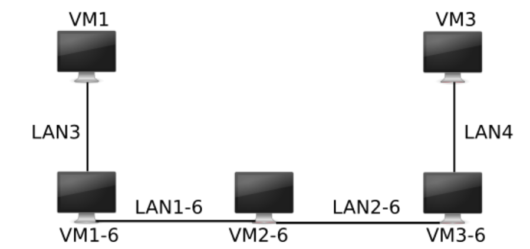
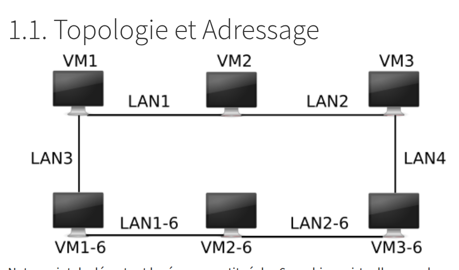
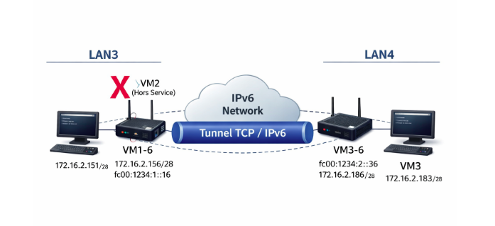
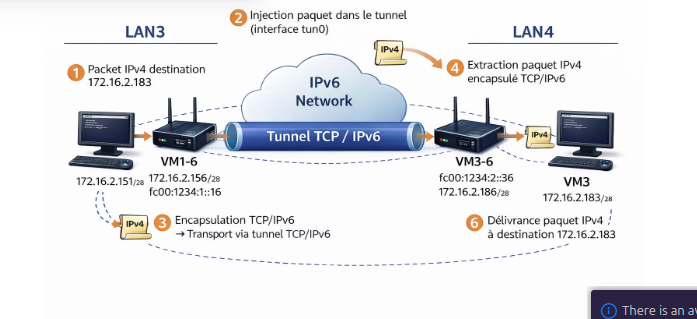

# Tunnel IPv4 sur TCP/IPv6

Ce dépôt implémente un tunnel IPv4 encapsulé dans un flux TCP/IPv6 à partir d'une interface TUN Linux. Le scénario simule la panne d'un routeur IPv4 intermédiaire (VM2) : deux îlots IPv4 (LAN3 et LAN4) doivent continuer à communiquer au travers d'un cœur IPv6 (VM1-6/VM2-6/VM3-6).

## Contexte et documents de référence
Les documents fournis sont dans `docs/` :
- Sujet de TP : [pageperso.lis-lab.fr_emmanuel.godard_enseignement_tps-reseaux_projet_.pdf](docs/pageperso.lis-lab.fr_emmanuel.godard_enseignement_tps-reseaux_projet_.pdf)
- Rapport de projet : [Réseau_Projet (1).pdf](docs/R%C3%A9seau_Projet%20(1).pdf)



## Architecture et topologie

Topologie initiale (VM2 opérationnelle) :


Topologie avec tunnel TCP/IPv6 entre VM1-6 et VM3-6 :


Chemin complet d'un paquet IPv4 via le tunnel :


### Nœuds et adressage (extrait)
| Nœud | Rôle | IPv4 | IPv6 |
| --- | --- | --- | --- |
| VM1 | Client IPv4 (LAN3) | 172.16.2.151/28 | - |
| VM3 | Serveur IPv4 (LAN4) | 172.16.2.183/28 | - |
| VM1-6 | Extrémité tunnel A | 172.16.2.156/28 | fc00:1234:1::16/64 |
| VM3-6 | Extrémité tunnel B | 172.16.2.186/28 | fc00:1234:2::36/64 |

Réseaux utilisés (rappel) :
- IPv4 LAN3 : 172.16.2.144/28
- IPv4 LAN4 : 172.16.2.176/28
- IPv6 LAN1-6 : fc00:1234:1::/64
- IPv6 LAN2-6 : fc00:1234:2::/64

## Organisation du dépôt
- `docs/` : sujet, rapport et images.
- `script/net/` : scripts d'adressage et de routage par VM.
- `src/iftun/` : création de tun0 (partie 2) + test `test_iftun.py`.
- `src/extremite/` : tunnel TCP/IPv6 (`tunnel46d.py`) et étapes intermédiaires (`ext_in.py`, `ext_out.py`, `test_main.py`).
- `VM/` et `VM-6/` : environnements Vagrant (IPv4 et IPv6).

## Prérequis
- Hôte Linux avec `/dev/net/tun` et droits root.
- Vagrant + VirtualBox (VMs fournies dans `VM/` et `VM-6/`).
- Python 3.
- Outils de validation : `ip`, `ping`, `nc`, `iperf3`.

## Mise en route

### 1) Démarrer les VMs
```bash
./VM/start_all_vms.sh
./VM-6/start_all_vms.sh
```

### 2) Configurer le réseau (dans chaque VM)
```bash
# VM1
sudo /vagrant/script/net/vm1_addr.sh
sudo /vagrant/script/net/vm1_routes.sh

# VM2
sudo /vagrant/script/net/vm2_addr.sh
sudo /vagrant/script/net/vm2_routes.sh

# VM3
sudo /vagrant/script/net/vm3_addr.sh
sudo /vagrant/script/net/vm3_routes.sh

# VM1-6
sudo /vagrant/script/net/vm1-6_addr.sh
sudo /vagrant/script/net/vm1-6_routes.sh
sudo /vagrant/script/net/vm1-6_routes_v4.sh

# VM2-6
sudo /vagrant/script/net/vm2-6_addr.sh

# VM3-6
sudo /vagrant/script/net/vm3-6_addr.sh
sudo /vagrant/script/net/vm3-6_routes.sh
```

Astuce : `script/net/clean_eth.sh` remet les interfaces propres si nécessaire.

### 3) Simuler la panne de VM2
```bash
cd VM/VM2 && vagrant halt
```

### 4) Lancer le tunnel TCP/IPv6
```bash
# VM3-6 (serveur)
sudo python3 /vagrant/src/extremite/tunnel46d.py listen 123

# VM1-6 (client)
sudo python3 /vagrant/src/extremite/tunnel46d.py connect fc00:1234:2::36 123
```

### 5) Configurer tun0 et les routes (exemple)
```bash
# VM1-6 : injecter LAN4 dans tun0
sudo ip addr add 172.16.2.1/24 dev tun0
sudo ip link set tun0 up
sudo ip route replace 172.16.2.176/28 dev tun0
sudo sysctl -w net.ipv4.ip_forward=1

# VM3-6 : injecter LAN3 dans tun0
sudo ip addr add 172.16.2.10/24 dev tun0
sudo ip link set tun0 up
sudo ip route replace 172.16.2.144/28 dev tun0
sudo sysctl -w net.ipv4.ip_forward=1

# VM1 : joindre LAN4 via VM1-6 (panne VM2)
sudo ip route replace 172.16.2.176/28 via 172.16.2.156

# VM3 : joindre LAN3 via VM3-6
sudo ip route replace 172.16.2.144/28 via 172.16.2.186
```

## Validation fonctionnelle
### Couche 3 (ICMP)
```bash
# Depuis VM1
ping 172.16.2.183
```

### Couche 4 (TCP)
```bash
# VM3
nc -l -p 12345

# VM1
echo "HELLO_TUNNEL" | nc 172.16.2.183 12345
```

### Bande passante (iperf3)
```bash
# VM3
iperf3 -s

# VM1
iperf3 -c 172.16.2.183 -n 1 -l 1M
```

## Notes d'implémentation
- `tunnel46d.py` crée `tun0` avec `IFF_NO_PI` et encapsule chaque paquet IPv4 avec une longueur sur 2 octets pour conserver le framing sur TCP.
- `ext_in.py` / `ext_out.py` servent de jalons pour la partie 3 (redirection sortante et entrante).
- `src/iftun/test_iftun.py` illustre la lecture brute de paquets sur tun0 pour la partie 2.
